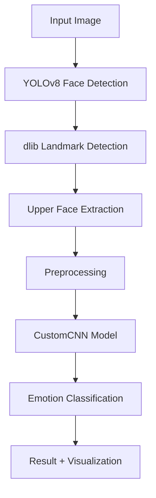

# 😊 Emotion Recognition from Upper Face

## 🎯 Project Overview

Educational project for **emotion recognition from the upper part of the face** (eyes and eyebrows), which is particularly relevant in the era of masks when the lower part of the face is hidden. The system automatically detects faces, extracts the upper region, and classifies emotions with **67.83% accuracy**.

### ✨ Key Features

- 🎭 **5 emotion classes**: anger, happiness, neutral, sadness, surprise
- 🔍 **Focus on upper face** - works even with masks
- 🤖 **3 neural network architectures** with complete performance comparison
- 📊 **Automatic data preprocessing** with visualization of all stages
- 🌐 **Web application** for demonstration with camera and file upload
- 📈 **Detailed analytics** and result visualization

## 🏗️ Architecture



## 📊 Model Results

| Model | Accuracy | Features |
|-------|----------|----------|
| **CustomCNN** | **67.83%** | 🏆 Best result, custom architecture |
| MobileNetV2 | 60.08% | Optimized for mobile devices |
| EfficientNetB0 | 35.61% | Modern efficient architecture |

## 🛠️ Technology Stack

### Machine Learning & Computer Vision
- **TensorFlow/Keras** - deep learning
- **OpenCV** - image processing
- **dlib** - facial landmark detection
- **YOLOv8** (Ultralytics) - face detection

### Data Science & Visualization
- **NumPy**, **Pandas** - data processing
- **Matplotlib**, **Seaborn** - visualization
- **scikit-learn** - metrics and analysis

### Web & Deployment
- **Streamlit** - web interface
- **PIL/Pillow** - image handling

### Data Sources
- **Kaggle Hub** - automatic dataset download
- **FER2013** and **Masked-FER2013** datasets

## 📦 Installation and Setup

### 1. Clone the repository
```bash
git clone https://github.com/kaido4835/emotion-recognition-upper-face.git
cd emotion-recognition-upper-face
```

### 2. Install dependencies
```bash
pip install -r requirements.txt
```

### 3. Download models
The script will automatically download necessary models:
- YOLOv8 face detection model
- dlib facial landmarks model

### 4. Prepare data (optional)
```bash
python Analysis.py
```
This script will:
- Download FER2013 and Masked-FER2013 datasets
- Process images and extract upper face regions
- Create a combined dataset
- Generate visualizations

### 5. Train models (optional)
```bash
python model.py
```

### 6. Run web application
```bash
streamlit run app.py
```

The application will be available at: `http://localhost:8501`

## 📁 Project Structure

```
emotion-recognition-upper-face/
├── 📄 app.py                    # Streamlit web application
├── 🧠 model.py                  # Model training and comparison
├── 🔬 Analysis.py               # Data preprocessing and analysis
├── 📋 requirements.txt          # Project dependencies
├── 📖 README.md                 # Documentation
├── 📁 models/                   # Pre-trained models (YOLOv8, dlib)
├── 📁 trained_models/           # Trained emotion models
├── 📁 upper_face_dataset/       # Processed data
├── 📁 visualizations/           # Charts and visualizations
└── 📁 output/                   # Temporary files
```

## 🎮 Usage

### Web Interface
1. Run `streamlit run app.py`
2. Upload an image or use camera
3. Get results with process visualization

### Programmatic Interface
```python
from model import load_model, recognize_emotion
from Analysis import extract_upper_face

# Load model
model = load_model('trained_models/CustomCNN_full.h5')

# Process image
upper_face = extract_upper_face(image, face_box, models)
emotion, probabilities = recognize_emotion(upper_face, model)

print(f"Recognized emotion: {emotion}")
print(f"Probabilities: {probabilities}")
```

## 📈 Visualizations and Analysis

The project includes an extensive visualization system:

### 📊 Data Analysis
- Emotion distribution in original datasets
- Preprocessing statistics
- Before/after comparison of upper face extraction

### 🔍 Processing Pipeline
- Step-by-step visualization of upper face extraction
- Face detector and landmark detection demonstration
- Examples for each emotion class

### 📋 Model Results
- Confusion Matrix for each model
- Training curves (accuracy/loss)
- Detailed metrics by class

## 🧪 Scientific Value

### Innovations
- **Upper face focus** - novel approach to emotion recognition
- **Mask compatibility** - relevant problem of modern times
- **Comparative analysis of architectures** - scientific approach

### Methodology
- Class balancing with weights
- Data augmentation
- Early stopping and LR scheduling
- Cross-validation through train/test split

## 🔮 Potential Improvements

- 🎯 Adding new emotions (disgust, fear)
- 🚀 Mobile device optimization
- 📱 Mobile application development
- 🎥 Real-time video processing
- 🌐 API for integration with other services
- 📊 Experiments with different architectures

## 👨‍💻 Author

**Mironshoh Rahmatullaev**
- GitHub: [@kaido4835](https://github.com/kaido4835)
- LinkedIn: [Mironshoh Rahmatullaev](https://www.linkedin.com/in/mironshoh-rahmatullaev-531197237/)
- Telegram: [@nacht003](https://t.me/nacht003)
- Discord: kaido02

*This is an educational project created for learning computer vision and machine learning.*

## 🙏 Acknowledgments

- [FER2013 Dataset](https://www.kaggle.com/datasets/msambare/fer2013) authors
- [Masked-FER2013 Dataset](https://www.kaggle.com/datasets/shubhanjaypandey/masked-fer2013) authors
- [YOLOv8 Face Detection](https://github.com/lindevs/yolov8-face) by lindevs
- [dlib library](http://dlib.net/) by Davis King
- Ultralytics for YOLOv8 framework

## 🚀 Create requirements.txt

```txt
tensorflow>=2.8.0
streamlit>=1.20.0
opencv-python>=4.5.0
dlib>=19.24.0
ultralytics>=8.0.0
numpy>=1.21.0
matplotlib>=3.5.0
seaborn>=0.11.0
scikit-learn>=1.0.0
Pillow>=8.3.0
kagglehub>=0.1.0
tqdm>=4.62.0
requests>=2.25.0
```

---

⭐ **Like the project? Give it a star!** ⭐
